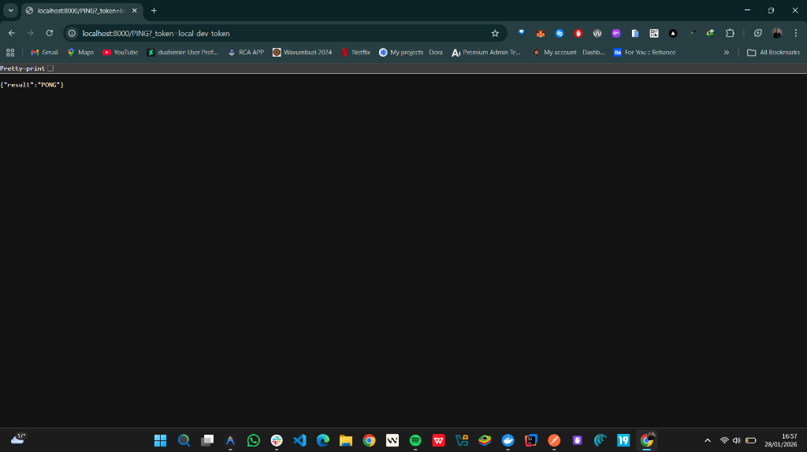
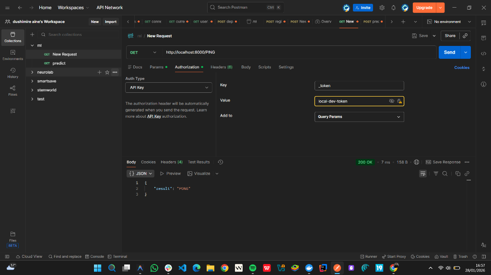
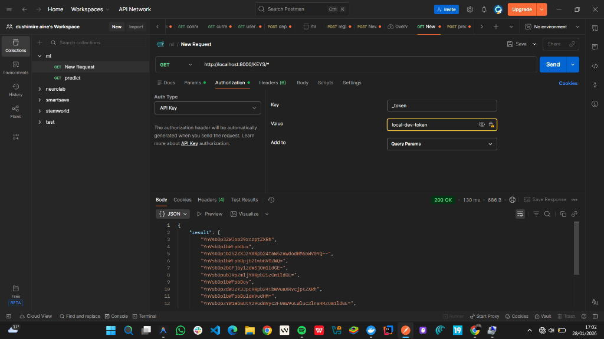

# upstash-redis-local

> A local webserver for testing and development using [`@upstash/redis`](https://github.com/upstash/upstash-redis)

## 🤔 What is upstash-redis-local?

The `upstash-redis-local` command starts a local web server that provides a REST API compatible with [Upstash REST API](https://docs.upstash.com/redis/features/restapi). It connects to a real Redis database instance, making it perfect for local development and testing.

**Key Features:**
- ✅ Compatible with `@upstash/redis` SDK
- ✅ Connection pooling for reliability
- ✅ Automatic retry on connection failures
- ✅ Docker Compose for easy setup
- ✅ Tiny Docker image (~10MB)

This project is inspired by [upstashdis](https://github.com/mna/upstashdis) but uses `fasthttp` for better performance.

## 💻 Usage

```bash
upstash-redis-local v1.0
A local server that mimics upstash-redis for local testing purposes!

       * Connect to any local redis of your choice for testing
       * Completely mimics the upstash REST API https://docs.upstash.com/redis/features/restapi

USAGE:
    upstash-redis-local
    upstash-redis-local --token upstash --addr :8000 --redis :6379

ARGUMENTS:
    --token       TOKEN  The API token to accept as authorised (default: upstash)
    --addr        ADDR   Address for the server to listen on (default: :8000)
    --redis       ADDR   Address to your redis server (default: :6379)
    --max-retries N      Max connection retries on startup (default: 10)
    --retry-delay MS     Delay between retries in milliseconds (default: 1000)
    --help               Prints this message

ENVIRONMENT VARIABLES:
    REDIS_ADDR     Redis server address (alternative to --redis)
    UPSTASH_ADDR   Webserver address (alternative to --addr)
    UPSTASH_TOKEN  API token (alternative to --token)
```

## ⬇ Installation

### Using Docker Compose (Recommended)

The easiest way to get started:

```bash
# Clone the repository
git clone https://github.com/aine1100/Upstash-Redis-Local-server.git
cd upstash-redis-local

# Start Redis and upstash-redis-local
docker-compose up -d

# Test the connection
curl -H "Authorization: Bearer local-dev-token" http://localhost:8000/PING
```

### Quick Start (Automated Script)

On Windows (Git Bash/WSL), macOS, or Linux, you can use the provided startup script:

```bash
chmod +x start.sh
./start.sh
```

This script will:
1. Check if Docker is running.
2. Attempt to start Docker Desktop if it's closed.
3. Start the containers using `docker-compose up -d`.

### Using Docker

```bash
# Run with a local Redis
docker run --rm -p 8000:8000 darthbenro008/upstash-redis-local:latest --redis host.docker.internal:6379

# Or link to a Redis container
docker run -d --name redis redis:7-alpine
docker run --rm -p 8000:8000 --link redis:redis darthbenro008/upstash-redis-local:latest --redis redis:6379
```

### Using Homebrew

```bash
brew tap aine1100/Upstash-Redis-Local-server
brew install upstash-redis-local
```

### Building from Source

```bash
# Clone and build
git clone https://github.com/aine1100/Upstash-Redis-Local-server.git
cd upstash-redis-local
make build

# Run
./bin/upstash-redis-local --redis :6379
```

### Manual Installation

Download the latest release from the [releases page](https://github.com/aine1100/Upstash-Redis-Local-server/releases) for your OS.

## 🔐 Authentication

The server requires an API token to authorize requests. By default, this token is `local-dev-token` (when using Docker Compose) or `upstash`.

### 1. In the Browser
Append the `_token` query parameter to your URL:
`http://localhost:8000/PING?_token=local-dev-token`



### 2. In the API Tool (Postman)
- **URL**: `http://localhost:8000/KEYS/*`
- **Auth Type**: Select `API Key`
- **Key**: `_token`
- **Value**: `local-dev-token`
- **Add to**: `Query Params` (Recommended)





### 3. Using cURL
```bash
curl -H "Authorization: Bearer local-dev-token" http://localhost:8000/PING
# OR
curl "http://localhost:8000/PING?_token=local-dev-token"
```

## 🔧 Using with @upstash/redis

```typescript
import { Redis } from '@upstash/redis'

const redis = new Redis({
  url: 'http://localhost:8000',
  token: 'local-dev-token', // or your custom token
})

// Use normally
await redis.set('foo', 'bar')
const value = await redis.get('foo')
console.log(value) // 'bar'
```

## 🐳 Docker Compose Configuration

The included `docker-compose.yml` provides:
- Redis 7 with health checks
- upstash-redis-local with automatic retry
- Persistent Redis data volume

```yaml
services:
  redis:
    image: redis:7-alpine
    ports:
      - "6379:6379"
  
  upstash-local:
    build: .
    ports:
      - "8000:8000"
    environment:
      - REDIS_ADDR=redis:6379
      - UPSTASH_TOKEN=local-dev-token
    depends_on:
      redis:
        condition: service_healthy
```

## 🔍 Viewing the Database

There are several ways to view and manage your local data:

### 1. Using Redis CLI (Inside Docker)
You can jump into the Redis container to run raw commands:
```bash
docker exec -it upstash-redis-local-redis-1 redis-cli
# Then try:
> keys *
> get foo
```

### 2. Using Redis Insight (GUI)
[Redis Insight](https://redis.com/redis-enterprise/redis-insight/) is a free, powerful GUI for Redis.
- **Host**: `localhost`
- **Port**: `6379`
- **Password**: (none by default)

### 3. Using HTTP Requests
Since this project mimics Upstash, you can just use your browser or `curl`:
- **Get all keys**: `http://localhost:8000/KEYS/*?_token=local-dev-token` 
- **Get value**: `http://localhost:8000/GET/mykey?_token=local-dev-token`

> [!NOTE]
> If you see random strings like `"YnVsb0..."`, it means you were viewing raw bytes. This has been fixed to return readable strings.

---


## 🔍 Troubleshooting

### Connection Refused
If you see `connection refused` errors:
1. Ensure Redis is running: `redis-cli ping`
2. Check the address format: `--redis localhost:6379` (not just `:6379`)
3. In Docker, use the service name: `--redis redis:6379`

### Docker Networking
When running in Docker, use:
- `host.docker.internal:6379` to connect to Redis on host machine
- The service name (e.g., `redis:6379`) when using Docker Compose

## 🤝 Contributions

- Feel free to open a PR/Issue for any feature or bug(s)
- Follow the [community guidelines](https://docs.github.com/en/github/site-policy/github-community-guidelines)
- See [CONTRIBUTING.md](CONTRIBUTING.md) for development setup

## ⚖ License

Copyright 2024 Hemanth Krishna

Licensed under MIT License: https://opensource.org/licenses/MIT

<p align="center">Made with ❤ and a single cup of kofi</p>